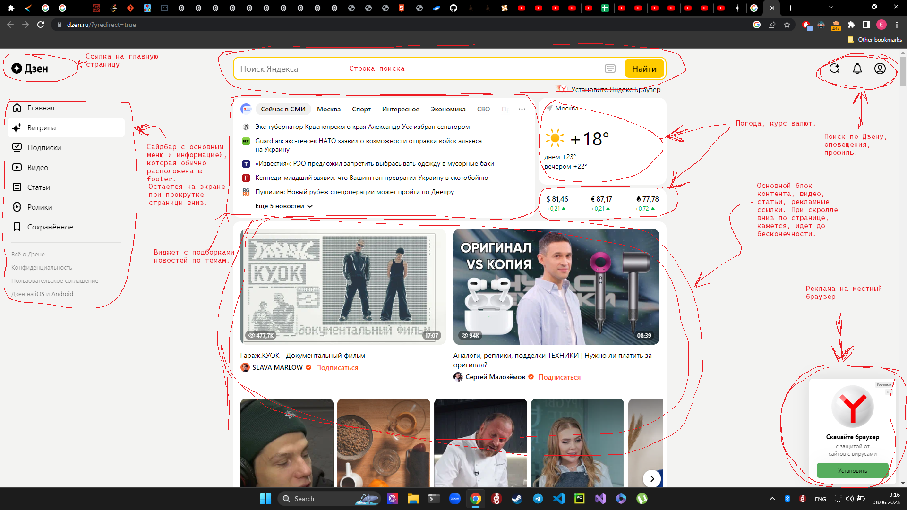
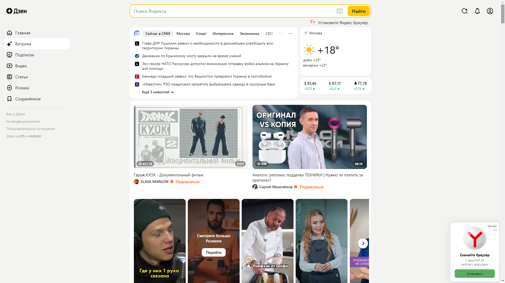
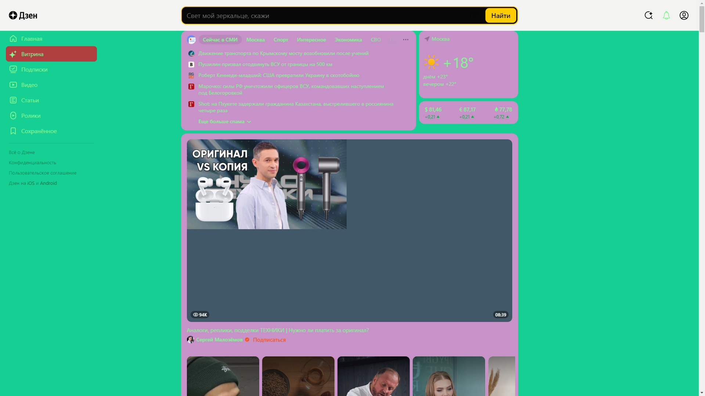

Задача: на основе сайта yandex.ru:
- Определите, на каком протоколе работает сайт.
- Проанализируйте структуру страницы сайта.
- Внесите не менее 10 изменений на страницу с помощью инструмента разработчика и представьте скриншоты было/стало.
---

## Страница работает на протоколе https.

---

## Изменения на странице:
1. Текст внутри строки поиска
2. Текст в виджете подборок новостей
3. Цвет бэкграунда основного блока контента
4. Цвет заднего бэкграунда основного блока контента
5. Удалил кнопку "Установите Яндекс Браузер" под строкой поиска
6. Цвет основного текста и иконок
7. Цвет подсвеченного пункта меню на сайдбаре
8. Удалил видео про Славу Marlow
9. Удалил рекламную ссылку на браузер снизу справа экрана
10. Цвет строки поиска

## До

## После

